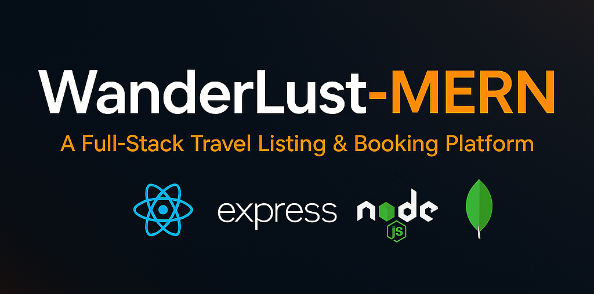

  

🏕️ WanderLust-MERN
WanderLust-MERN is a full-stack travel booking and listing platform built with the MERN stack (MongoDB, Express.js, React.js, Node.js).
It showcases modern web development features like secure payments, interactive maps, advanced filtering, reviews, dashboards, and real-time notifications.

✨ Features
User Authentication & Authorization – Register, login, sessions with Passport.js and JWT.

Property Listings – CRUD operations, Cloudinary image storage, geocoding via OpenStreetMap, and live maps with Leaflet.

Booking System – Book listings, view history, owner dashboards, and real-time payment updates.

Payments Integration – Secure payment processing with Cashfree Payment Gateway.

Reviews & Ratings – Authenticated users can post and manage reviews.

Advanced Filtering – Filter by category, price, amenities, etc.

Email Communication – Automated support/contact emails via Nodemailer.

Interactive Maps – Live location previews with custom markers.

Dashboards & Analytics – Visualize earnings, bookings, etc., with Chart.js.

Notifications – Real-time UI alerts and toasts.

🚀 Tech Stack & Major Libraries
🖥️ Frontend
React.js (Vite)

React Router DOM

Context API (authentication & notifications)

Bootstrap 5, FontAwesome, custom CSS

Leaflet & react-leaflet (maps)

Cashfree JS SDK

Chart.js & react-chartjs-2

Axios

⚙️ Backend
Node.js & Express.js

MongoDB Atlas & Mongoose

Passport.js & passport-local-mongoose

Multer & Cloudinary (image uploads)

Nodemailer

Joi (validation)

express-session & connect-mongo (session storage)

Moment.js

dotenv, CORS, method-override, axios

EJS (minimal server-side rendering)

📍 3rd Party APIs & Integrations
OpenStreetMap / Nominatim API – Geocoding

Cashfree Payment Gateway – Secure booking payments

Cloudinary – Image storage

Gmail SMTP (Nodemailer) – Automated emails

🗂️ Folder Structure
csharp
Copy
Edit
WanderLust-MERN/
├── client/         # React frontend (components, pages, context)
├── server/         # Express backend (routes, controllers, models)
├── public/         # Static files
├── .env.example    # Example environment variables
🎯 Key Libraries & Functionalities
Authentication: Passport.js, express-session, JWT, bcrypt

Payments: Cashfree integration (client & server)

Maps: Leaflet, react-leaflet, OpenStreetMap

Image Upload: Multer & Cloudinary

Emails: Nodemailer

Analytics: Chart.js, moment.js

Reviews: CRUD operations with user checks

Filtering: Custom React & JavaScript filters

Notifications: React context, toasts

UI/UX: Bootstrap, FontAwesome, custom CSS

API Requests: Axios

👤 Author
Created and maintained by Gundelly Vamshi Yadav

⚠️ License
All rights reserved © Gundelly Vamshi Yadav.
This project is shared publicly for viewing and portfolio purposes only.
Forking, cloning, copying, or commercial use is strictly prohibited.
